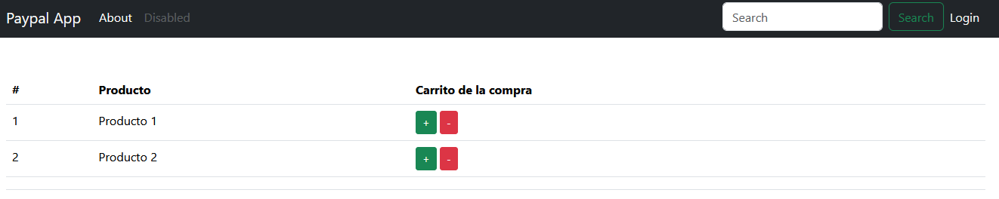
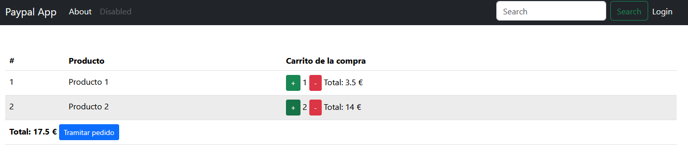
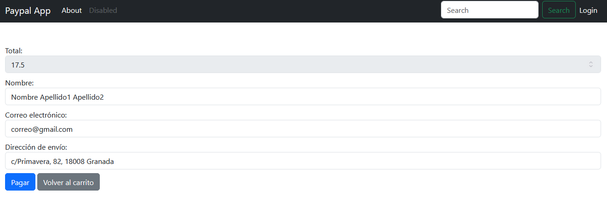
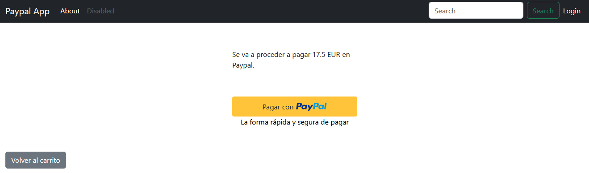
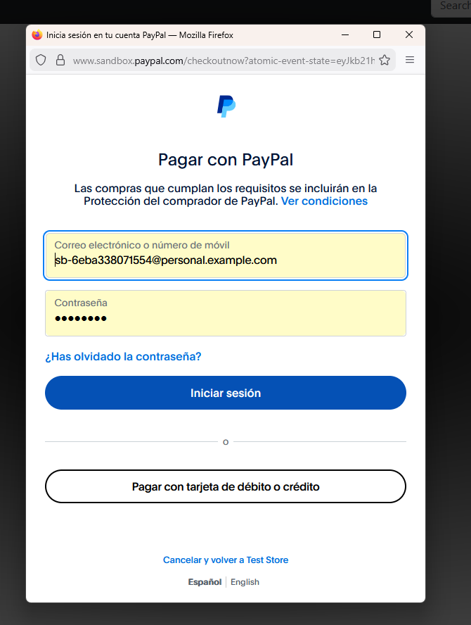
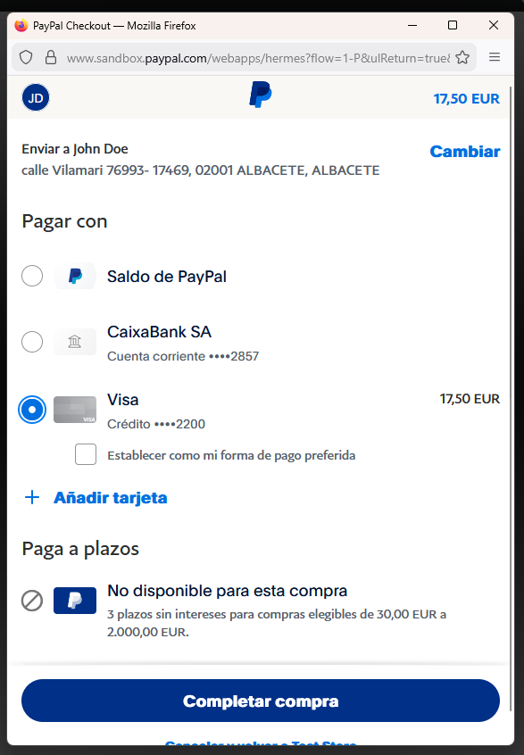
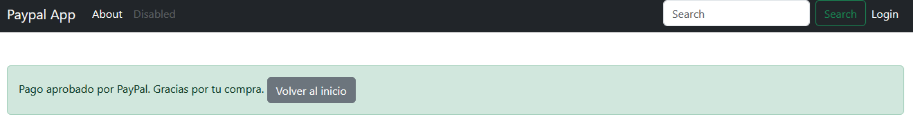
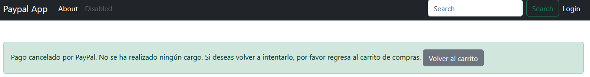
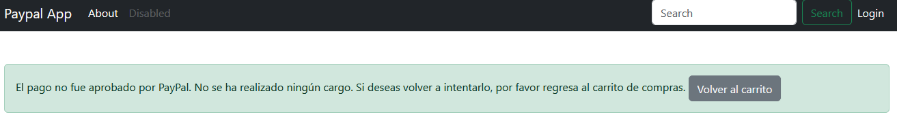
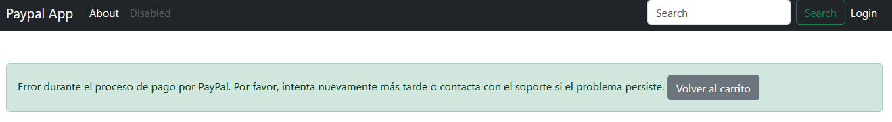

<p align="center"><a href="https://laravel.com" target="_blank"></a></p>

<p align="center">
<a href="https://github.com/laravel/framework/actions"></a>
<a href="https://packagist.org/packages/laravel/framework"></a>
<a href="https://packagist.org/packages/laravel/framework"></a>
<a href="https://packagist.org/packages/laravel/framework"></a>
</p>

## Pagos en Paypal

Aplicación de ejemplo en la que se realizan pagos a través de Paypal.

- [Pago en línea o checkout](https://developer.paypal.com/docs/checkout/).
- [Pago mediante suscripción](https://developer.paypal.com/docs/subscriptions/).

## [Paypal developer](https://developer.paypal.com/home/)

Para poder usar el pago hay que darse de alta en Paypal Developer.

Se necesitan las siguientes credenciales:

- Nombre de usuario del cliente de la API.
- Clave de acceso del cliente de la API.
- Identificador del webhook mediante el que se van a recibir las notificaciones de los pagos recibidos.
- Correo electrónico del cliente de la tienda.
- Clave de acceso del cliente de la tienda.

## Datos de .env

```
PAYPAL_CURRENCY=EUR
PAYPAL_MODE=sandbox
PAYPAL_SANDBOX_CLIENT_ID=ASK...eaU
PAYPAL_SANDBOX_CLIENT_SECRET=EPg...kYB
PAYPAL_WEBHOOK=42N8...70B

DB_CONNECTION=mysql
DB_HOST=127.0.0.1
DB_PORT=3306
DB_DATABASE=...
DB_USERNAME=...
DB_PASSWORD=...
```

### Dependencias de compose

```
composer require srmklive/paypal
php artisan install:api
php artisan migrate
```

## Proceso












## License

The Laravel framework is open-sourced software licensed under the [MIT license](https://opensource.org/licenses/MIT).
